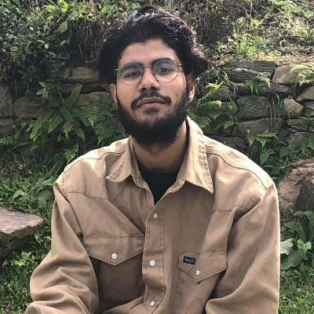

# About Me

I am a Computer Science Information Tech. (CSIT) Student.

I love exploring and writing.

Artificial Intelligence - especially Computer Vision implementation - is what I love exploring, building and implementing.
I am writing this blog to track my progress over time, may be someday this might help someone as well. :D

If I find something useful or interesting, I will generously share it. 

